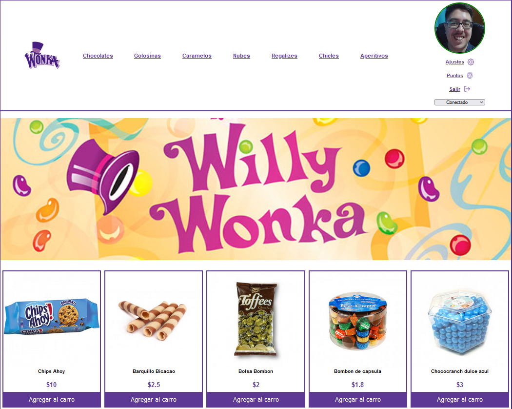

# WillyWonka

This is a php project based on making purchases of products, within the web page.

---

## Table of contents

- [Description](#description)
- [Technologies](#technologies)
- [Installation](#installation)

## Description

This is a php project based on making purchases of products, within the web page. In this project, you will be able to make purchases, personalize your user, chat with a personalized bot, view the invoices of the products you have purchased, attend draws for price discounts on products, etc.

## Technologies

The project has been created with:

- HTML
- CSS
- PHP > 7
- JS

## Installation

To run this project, we need the following steps:

- Download XAMPP at the following link: https://www.apachefriends.org/

- Open XAMPP control panel and turn on apache and mysql services.

- Go to your browser to the path of localhost/phpmyadmin and you will see the phpmyadmin database manager running.

- Once inside the phpmyadmin database manager, you have to click the import option. You must select the sql file, which is located in the bbdd folder of this project, which is the following: https://github.com/adri27info/WillyWonka/blob/master/bbdd/sql/willywonka.sql

- Once the database is imported through the sql file, we go to the project path, which will be found in the path: http://localhost/WillyWonka/index.php

- Finally we will have to access through the default user that I have left in the form.
